# Store Management System

**Offline desktop** application for managing products, inventory, and sales in physical retail stores. **Portuguese (pt-BR)** or **English (en)** interface, **light or dark theme**, and a counter-focused workflow: barcode scanning, multi-item cart, filtered history views, and an analytics dashboard.

> **Languages:** [Português (pt-BR)](README.md) · **English**

---

## Application preview

Screenshots captured in a **maximized window** with demo data (`npm run seed`). Four combinations: Portuguese/English × dark/light theme.

### Dashboard — comparison

| | Dark | Light |
|---|:---:|:---:|
| **Portuguese** | 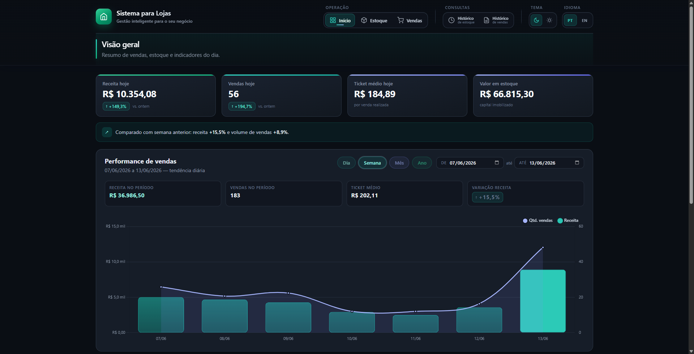 | 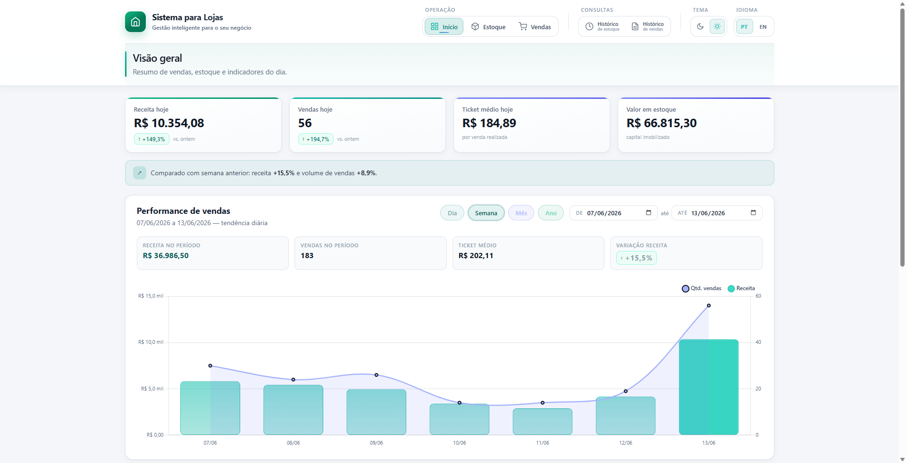 |
| **English** | 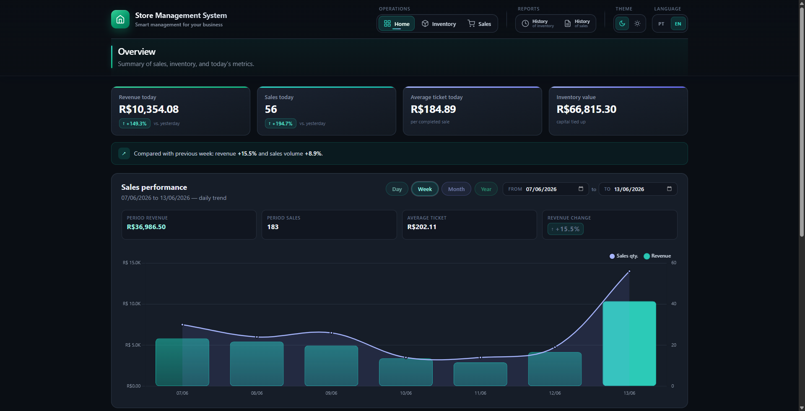 | 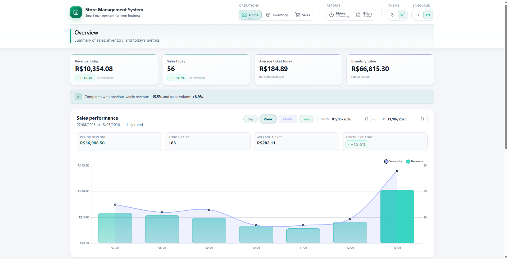 |

### Portuguese · dark theme

| Dashboard | Sales |
|:---:|:---:|
|  | 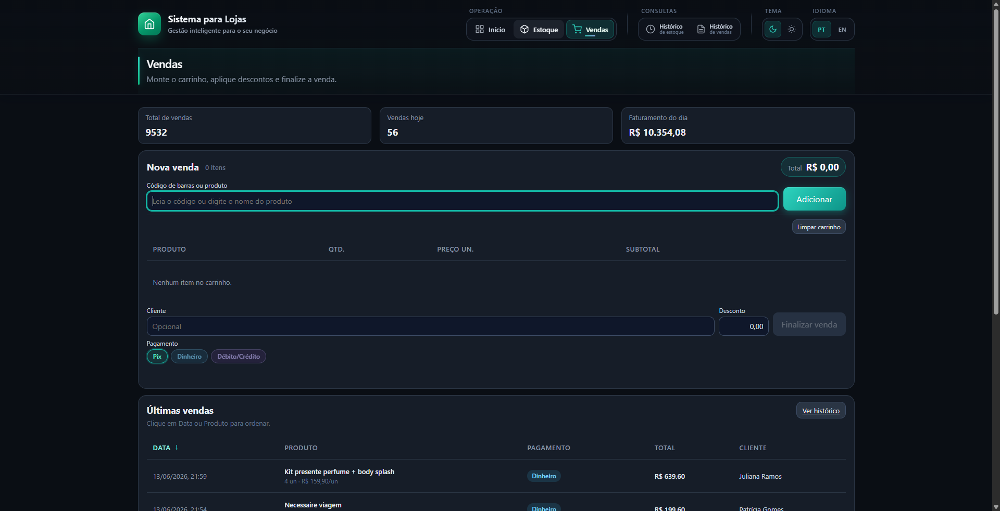 |

| Inventory | Sales history | Stock history |
|:---:|:---:|:---:|
| 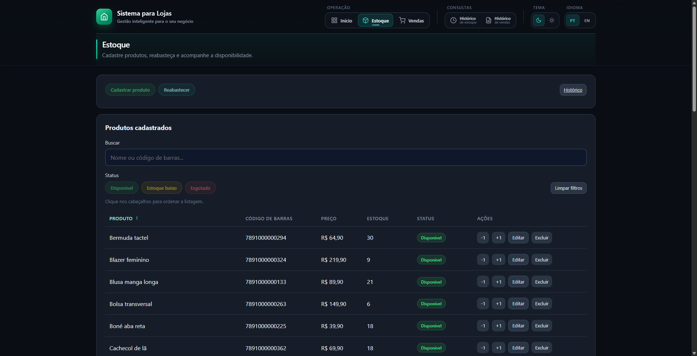 | 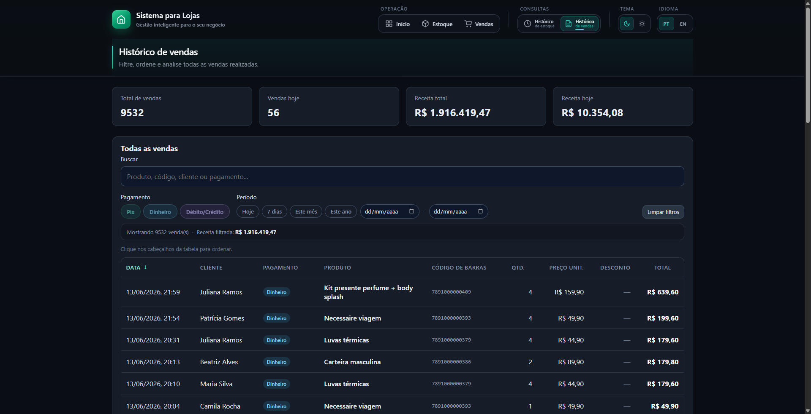 | 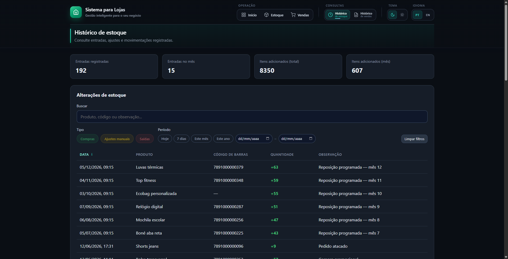 |

### Portuguese · light theme

| Dashboard | Sales |
|:---:|:---:|
|  | 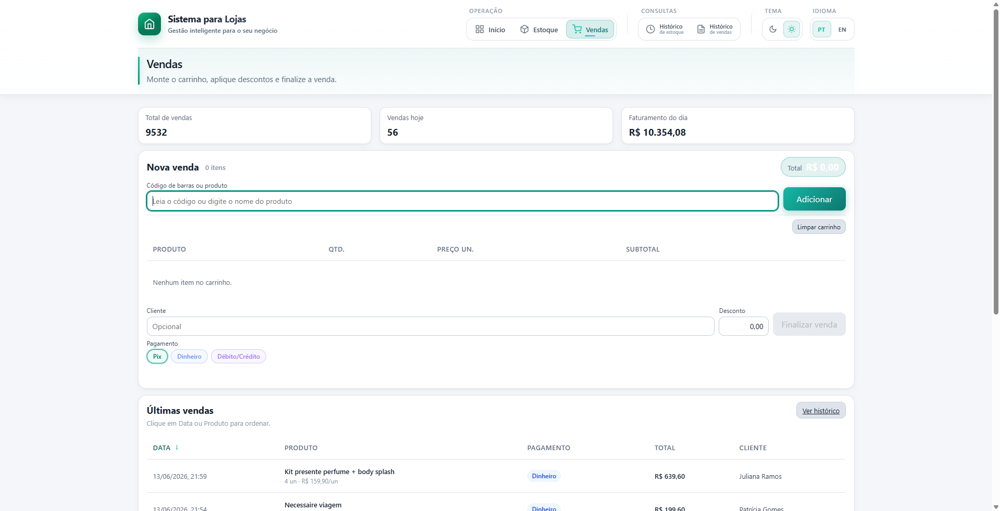 |

| Inventory | Sales history | Stock history |
|:---:|:---:|:---:|
| 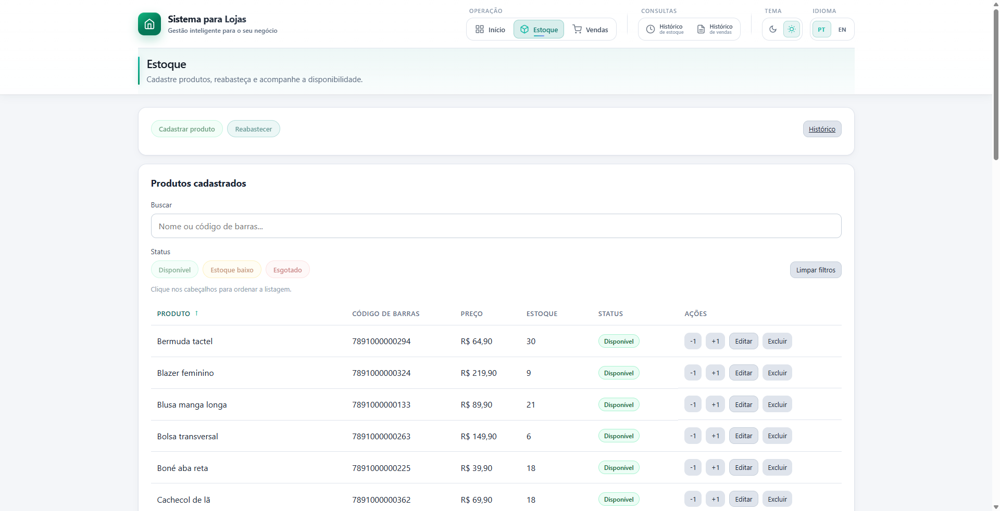 | 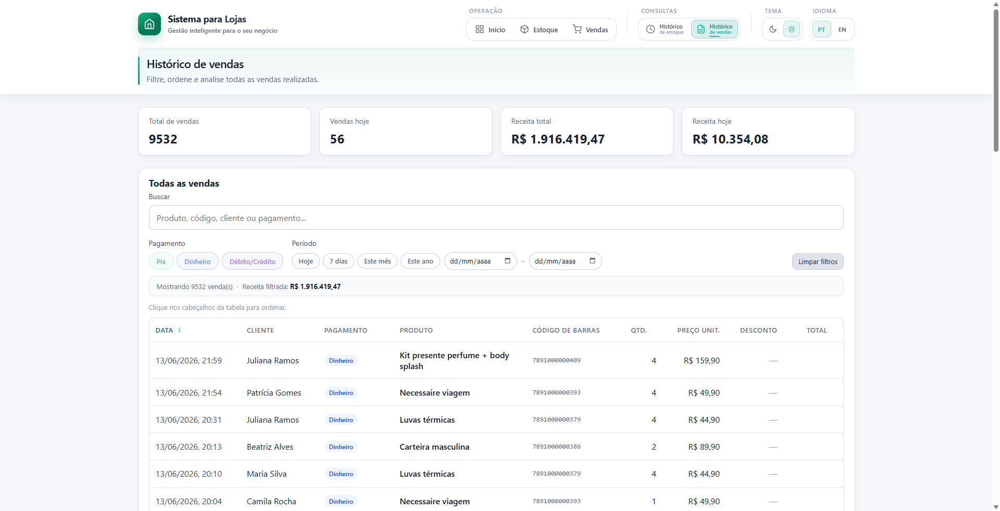 | 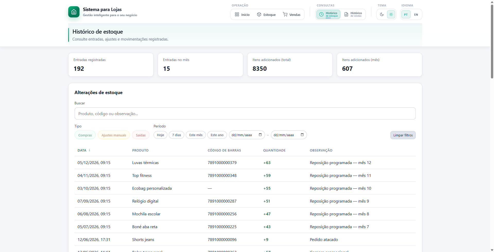 |

### English · dark theme

| Dashboard | Sales |
|:---:|:---:|
|  | 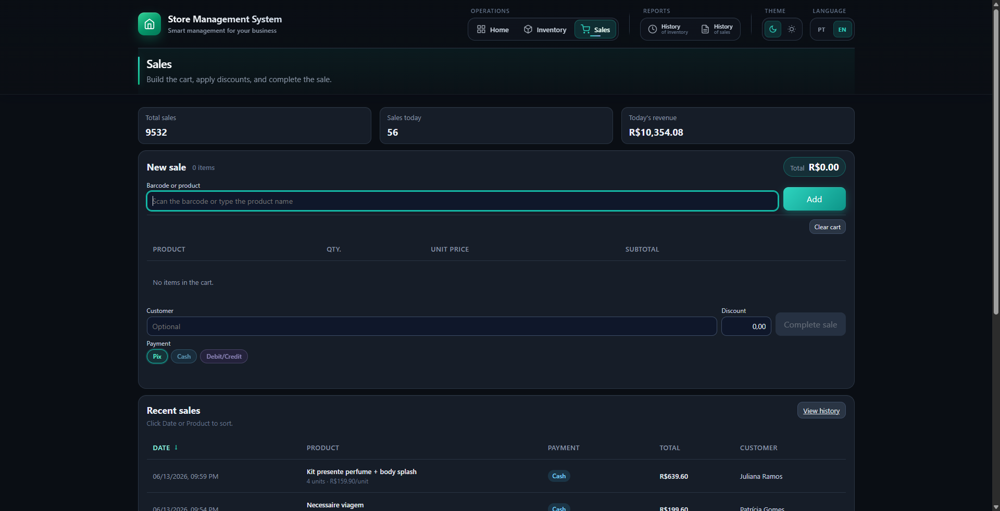 |

| Inventory | Sales history | Stock history |
|:---:|:---:|:---:|
|  | 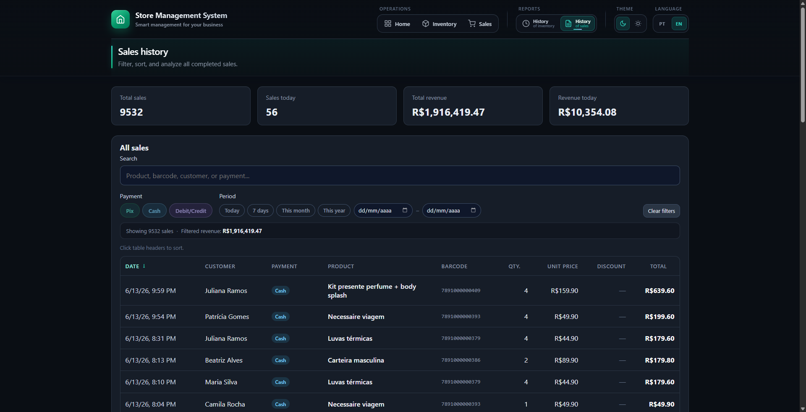 | 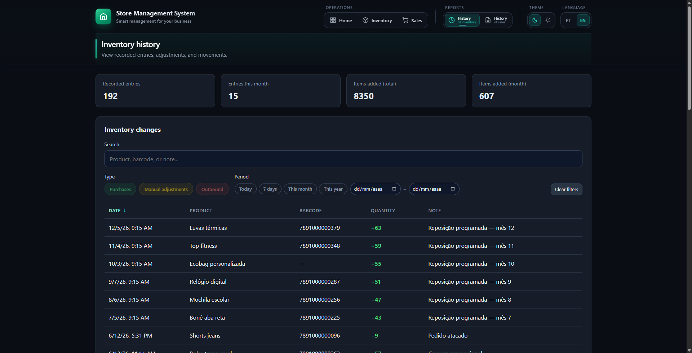 |

### English · light theme

| Dashboard | Sales |
|:---:|:---:|
|  | 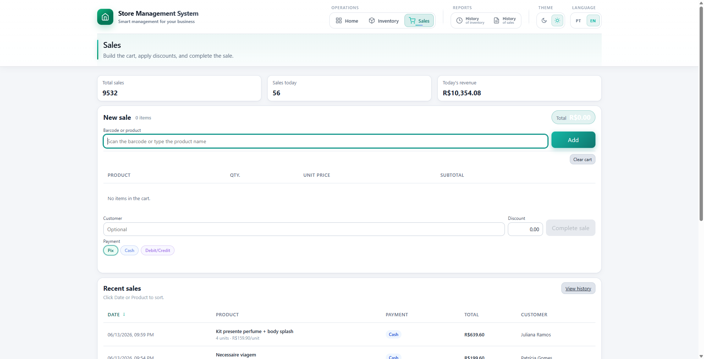 |

| Inventory | Sales history | Stock history |
|:---:|:---:|:---:|
| 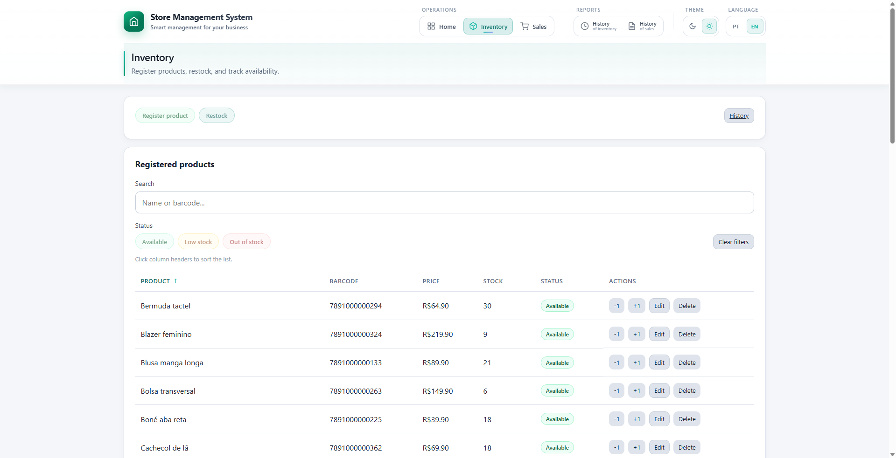 | 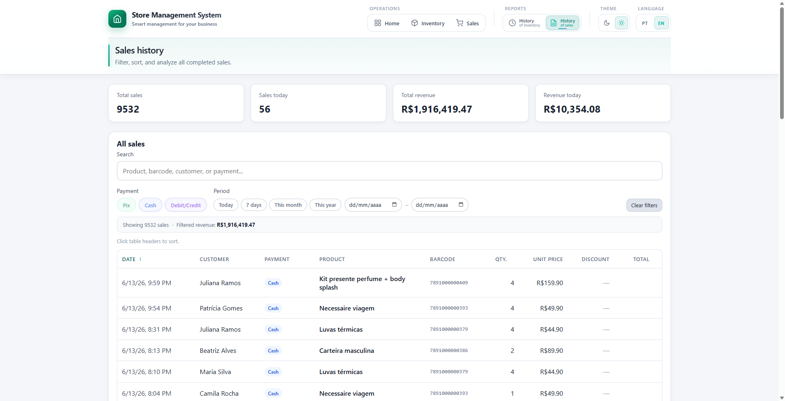 | 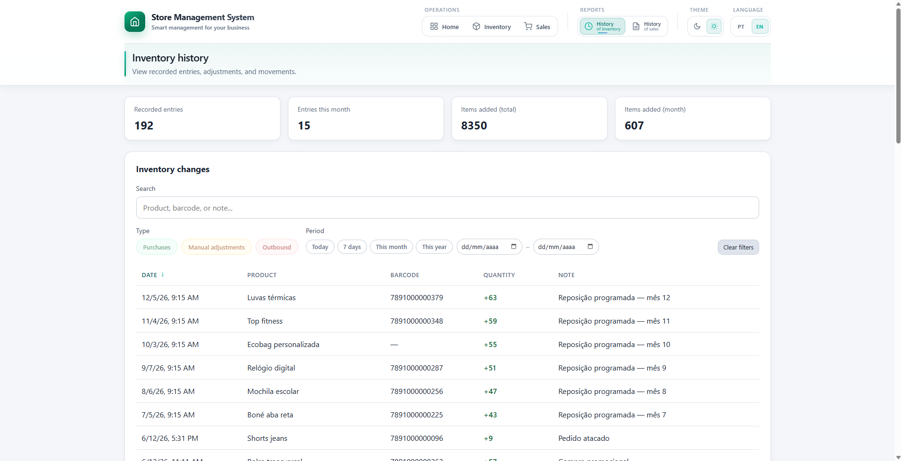 |

> Regenerate all images: `npm run screenshots` (build + seed + automated capture).
>
> **Images only appear on GitHub after they are committed.** Include `docs/screenshots/` in your commit and push (`git add docs/screenshots README.md README.en.md` → commit → push).

---

## Features

- **Dashboard** — Daily KPIs, performance chart (day/week/month/year with From/To range), product ranking, payment mix, and stock alerts.
- **Inventory** — Product registration, restocking, ±1 adjustments, search, status filters, and pagination.
- **Sales (POS)** — Cart with barcode scanner, name suggestions, discounts, payment methods (Pix, Cash, Debit/Credit).
- **History** — Sales and stock movements with filters, sorting, and pagination (50 items per page).
- **Offline** — Data persisted locally in SQLite, no internet required.
- **Light/dark theme** — toggle in the header, preference saved locally.
- **Languages** — Portuguese (pt-BR) or English (en) interface with persistent preference.

---

## Tech stack

| Layer | Technology | Role |
|--------|------------|------|
| Desktop | [Electron](https://www.electronjs.org/) 41 | Native shell, window, secure IPC |
| Language | [TypeScript](https://www.typescriptlang.org/) 5.8 | Typing across main, renderer, and tests |
| UI | HTML + CSS | No UI framework — direct DOM, modular CSS |
| Charts | [Chart.js](https://www.chartjs.org/) 4 | Sales performance, ranking, and payment mix |
| Database | [sql.js](https://sql.js.org/) 1.14 | Local SQLite file (`sistema.db`) |
| Build | `tsc` + [esbuild](https://esbuild.github.io/) | Main compiled; renderer bundled |
| Tests | [Vitest](https://vitest.dev/) 4 + jsdom | 157 tests, 100% line coverage |

---

## Getting started

### Prerequisites

- **Node.js** 18 or higher
- **npm** 9 or higher

### Installation and development

```bash
# 1. Clone and install dependencies
git clone <repository-url>
cd sistema-para-lojas
npm install

# 2. (Optional) Populate demo database
npm run seed

# 3. Development mode — hot reload for main, renderer, and assets
npm run dev
```

### Local production

```bash
npm run build   # compiles to dist/
npm start       # build + launch Electron
```

### Tests

```bash
npm test              # full test suite
npm run test:watch    # interactive mode
npm run test:coverage # coverage report (100% lines/functions)
```

### Useful scripts

| Command | Description |
|---------|-------------|
| `npm run dev` | Development with watchers + Electron |
| `npm run build` | Compiles main, renderer, and copies HTML/CSS |
| `npm start` | Build and run the app |
| `npm run seed` | Recreates `data/sistema.db` with demo data |
| `npm run backfill-payments` | Fills payment method for legacy sales |
| `npm run screenshots` | Generates images in `docs/screenshots/{pt-dark,pt-light,en-dark,en-light}/` |

---

## Database

SQLite is stored at:

- **Development:** `data/sistema.db` (when the `data/` folder exists in the project)
- **Production:** `%APPDATA%/sistema/sistema.db` (Windows) — used when there is no local `data/` folder

Main tables: `products`, `sales`, `stock_entries`, `meta`.

The `data/` folder is in `.gitignore`; use `npm run seed` to create a local test database.

---

## Demo data (`npm run seed`)

The seed recreates the database with a realistic scenario:

- **40 products** (apparel, footwear, accessories)
- **~190 stock entries** over the last 6 months
- **~9,500 sales** over 2 years, with seasonality and weekend peaks
- **Varied payment methods** (~45% Pix, ~33% Debit/Credit, ~22% Cash)

---

## Architecture

```
src/
├── main.ts                 # Electron main process
├── preload.ts              # Secure bridge (contextBridge → electronAPI)
├── index.html              # Layout for all screens (SPA)
├── styles/                 # base, layout, components, navigation, dashboard
├── database/               # connection, seed, migrations
├── repositories/           # SQL and row → type mapping
├── services/               # business rules and transactions
├── ipc/                    # main ↔ renderer handlers
├── types/                  # shared types
└── renderer/
    ├── index.ts            # bootstrap and route registration
    ├── router.ts           # SPA navigation
    ├── pages/              # one page per screen
    ├── components/         # Chart.js charts
    ├── state/              # reactive state (subscribe + refresh)
    └── utils/              # formatting, filters, sorting
```

Operation flow (e.g. completing a sale):

```
Renderer (page) → electronAPI (preload) → IPC handler → Service → Repository → SQLite
```

---

## Design decisions

### Electron + offline first

Physical stores need a **fast, reliable system without internet**. Electron delivers a desktop app with a web foundation, installable and familiar to maintain.

### SQLite via sql.js (local file)

- Data stays on the merchant's machine, with no external server.
- SQL transactions ensure consistency for sales and stock adjustments.
- `sql.js` runs SQLite in WASM — works in Electron's Node process without extra native binaries.

### Plain HTML/CSS (no React/Vue)

- Lean scope: few screens, lots of form and table interaction.
- Avoids bundle overhead and framework reactive-state complexity.
- Modular CSS (`base`, `layout`, `components`, `dashboard`) keeps the UI consistent.

### IPC with contextIsolation

The renderer **does not access Node.js** directly. All communication goes through `preload.ts` + `contextBridge`, exposing a typed API (`window.electronAPI`). This follows Electron's security recommendations.

### Layers: Repository → Service → Page

| Layer | Responsibility |
|--------|------------------|
| **Repository** | SQL, paginated queries, row mapping |
| **Service** | Validation, transactions, rules (e.g. stock deduction on cart checkout) |
| **Page (renderer)** | DOM, events, pt-BR formatting, user feedback |

Clear separation makes it easy to unit-test each layer without spinning up the full UI.

### Lightweight SPA router

Five routes toggled via CSS (`.screen.active`). The last visited route is saved in `sessionStorage` and restored when reopening the app — useful when operators switch between Sales and Inventory all day.

### Pagination on large lists

Sales history, stock history, and product listing use **50 items per page**. Avoids freezing when rendering thousands of rows in the DOM at once.

### Analytics dashboard

- **Sales performance:** chart with Day/Week/Month/Year granularity and From/To filter for custom analysis.
- **Ranking and payment mix:** complementary visualizations on the same panel.
- **Stock alerts:** up to 5 out-of-stock or below-minimum items (threshold = 5 units), visually aligned with the ranking, with refined scrolling.

### Stock status

| Status | Rule |
|--------|------|
| Out of stock | quantity = 0 |
| Low stock | 1 to 5 units |
| Available | 6 or more |

### pt-BR formatting

Monetary values with comma (`R$ 10,50`), readable dates, and error messages in Portuguese — aligned with real counter use in Brazil.

### Automated tests

Vitest covers backend (repositories, services, IPC), renderer (pages, router, utils), and scripts. **100% coverage on lines, functions, and statements** ensures regressions are visible as the system evolves.

---

## Out of scope (for now)

- Multi-user / login
- Tax invoice (NF-e) issuance
- Cloud sync
- Fiscal printer
- Multiple stores / branches
